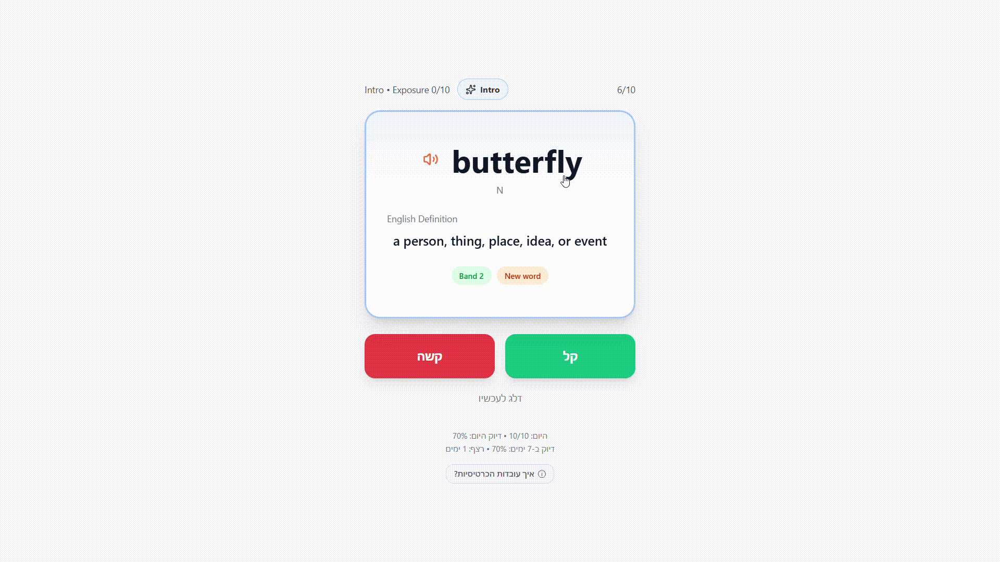

# Magic E — Bagrut Vocabulary Learning App

> **Portfolio prototype** — An instructional-design and EdTech demo built for Israeli high school students preparing for the English Bagrut Module E vocabulary exam.

**Live demo:** `https://english-app-liard-one.vercel.app/`

---

## Demo Preview



---

---

## Screenshots

### Dashboard


### Flashcard Session


### Exam Mode


### Flashcard Types Explanation


---
## Highlights

- 4,100+ Bagrut vocabulary words
- Spaced repetition learning flow
- Adaptive flashcard modes
- Exam-style Module E simulation
- Mobile-first RTL Hebrew UI

---

## Overview

Magic E is a client-side React application that helps students master the ~4,100-word Module E vocabulary list through spaced repetition and active recall. The UI is Hebrew-first (RTL), mobile-optimised, and requires no account or backend — all progress is stored locally in the browser.

The project is a portfolio prototype demonstrating learning-design thinking applied to a real exam context, not a production product.

---

## Educational Problem

The Israeli Bagrut Module E exam tests passive recognition of a large, fixed vocabulary list under timed conditions. Students typically prepare using static word lists or generic flashcard apps, neither of which reflects the exam format or applies evidence-based retention strategies.

Key challenges this prototype addresses:

- **Volume** — ~4,100 words is too many to study linearly; prioritisation is essential
- **Exam format** — Module E tests definition-matching, not translation; practice should mirror this
- **Retention** — cramming before an exam produces poor long-term recall; spaced review is more effective
- **Motivation** — students need visible progress signals to maintain daily habits

---

## Key Features

- **Spaced repetition queue** — words are scheduled based on performance, prioritising overdue and recently-failed cards
- **Four adaptive card modes** — card difficulty increases automatically with exposure (see Learning Design below)
- **Exam simulation** — a dedicated mode that mirrors the Module E definition-matching format (3 words → 3 definitions from a pool of 6)
- **Daily goal and streak tracking** — 10-word daily target with a rolling 7-day accuracy view
- **Word list with search and filtering** — browse all 4,100+ words by learning status (New / Learning / Needs Review / Strong / Mastered)
- **Text-to-speech** — browser-native pronunciation for words and example sentences
- **RTL Hebrew UI** — full right-to-left layout with Hebrew labels and instructions
- **Zero-dependency persistence** — all progress stored in `localStorage`; no login required

---

## Learning Design

### Spaced Repetition

The scheduling algorithm is a simplified SM-2 implementation. Each word carries a level (0–5), an interval, and a due date. Easy responses advance the level and extend the interval; Hard responses reset it. Words marked Hard are re-queued within the same session.

### Four Exposure-Based Card Modes

Card type is determined automatically by how many times a student has seen a word:

| Mode | Exposure | Behaviour |
|------|----------|-----------|
| **Intro** | First encounter | Word and definition shown together — no recall required, builds initial recognition |
| **Recall** | 1–3 times | Standard active recall: word shown, student recalls definition before flipping |
| **Reverse** | 4–6 times | Reverse recall: definition shown, student recalls the word — tests deeper encoding |
| **Exam** | 7–10 times | Context-gap format: word masked in an example sentence, Hebrew hidden by default — closest to actual exam conditions |

The goal is to gradually reduce support as students become more familiar with a word, encouraging stronger recall over time.

### Session Composition

Each 10-card session is assembled from four buckets in priority order:

1. Words flagged for immediate review (answered Hard this session)
2. Words overdue by scheduled date
3. Words in active learning (exposure > 0, level < 3)
4. New words (first encounter)

This ensures review of weakest material without abandoning newly introduced words.

---

## Tech Stack

| Layer | Tool |
|-------|------|
| Framework | React 19 + Vite |
| Styling | Tailwind CSS v4 |
| Animation | Framer Motion |
| Icons | Lucide React |
| Persistence | Browser `localStorage` |
| Deployment | Vercel (static) |

No backend. No database. No authentication.

---

## Local Setup

```bash
npm install
npm run dev       # development server at localhost:5173
npm run build     # production build → dist/
npm run preview   # preview the production build locally
```

---

## Demo

The app opens directly on the Dashboard. To explore the learning design:

1. **Start Session** — work through a 10-card session; notice how card mode changes as exposure increases
2. **Exam Mode** — simulates the Module E definition-matching format after enough words are learned
3. **Words List** — search and filter the full vocabulary by learning status
4. Click **ⓘ איך עובדות הכרטיסיות?** at the bottom of any flashcard for a card-type legend

---

## Future Improvements

These are intentionally out of scope for the current prototype:

- **Cloud sync** — progress currently lives in `localStorage` only; a backend (e.g. Supabase) would enable multi-device use
- **Teacher dashboard** — class-level progress tracking and goal setting
- **Audio corpus** — human-recorded audio for every word; currently using browser TTS
- **Content quality pass** — most definitions and example sentences are AI-generated and would benefit from editorial review before production use
- **Adaptive daily goal** — personalised targets based on exam date proximity and historical accuracy
- **Offline PWA** — service worker for reliable offline access on mobile

---

## Project Context

Built as an instructional-design portfolio piece. The vocabulary dataset is derived from the official Bagrut Module E word list. This is a prototype — it is not affiliated with the Israeli Ministry of Education.
